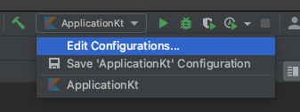
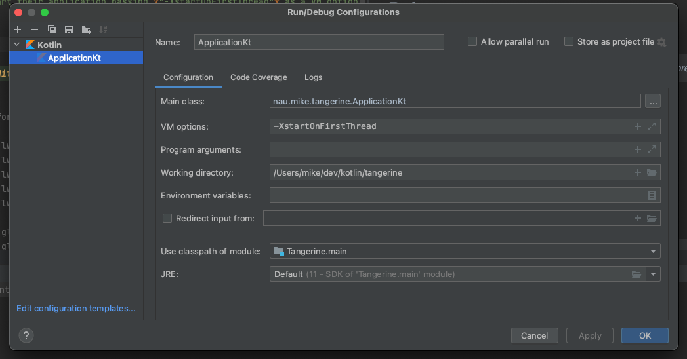

# Tangerine Game Engine

*An OpenGL Game Engine developed in Kotlin*

---
## References
## [LWJGL](https://www.lwjgl.org/guide)
> MacOS users should start their application passing *"-XstartOnFirstThread"* as a VM option.

**Steps**
1. Edit config



2. Paste *-XstartOnFirstThread* in `VM options`



**Dependencies**

```
    implementation(platform("org.lwjgl:lwjgl-bom:3.2.3"))

    implementation("org.lwjgl", "lwjgl")
    implementation("org.lwjgl", "lwjgl-glfw")
    implementation("org.lwjgl", "lwjgl-jemalloc")
    implementation("org.lwjgl", "lwjgl-openal")
    implementation("org.lwjgl", "lwjgl-opengl")
    
    runtimeOnly("org.lwjgl", "lwjgl", classifier = "natives-macos")
    runtimeOnly("org.lwjgl", "lwjgl-glfw", classifier = "natives-macos")
    runtimeOnly("org.lwjgl", "lwjgl-jemalloc", classifier = "natives-macos")
    runtimeOnly("org.lwjgl", "lwjgl-openal", classifier = "natives-macos")
    runtimeOnly("org.lwjgl", "lwjgl-opengl", classifier = "natives-macos")
```

## [ImGui](https://github.com/SpaiR/imgui-java)

**Dependencies**

```
    implementation("io.github.spair", "imgui-java-binding", "1.83.0")
    implementation("io.github.spair", "imgui-java-lwjgl3", "1.83.0")
    implementation("io.github.spair", "imgui-java-natives-macos", "1.83.0")
```